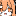
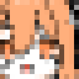

# bitmap_to_colored_grids_svg

[](https://www.python.org/)
[](https://python-pillow.org/)
[](https://github.com/mozman/svgwrite)
[](https://github.com/Unnamed2964/bitmap_to_colored_grids_svg)

Convert bitmap images into SVGs made of colored rectangles, one rectangle per pixel.

## Quick Start

Run these commands in the project directory.

> Optional: if you prefer an isolated environment, create and activate a virtual environment before installing the dependencies. 
> 
> If you do not know what this means, skip it.

### 1. Install dependencies

```bash
python -m pip install pillow svgwrite
```

### 2. Run the sample conversion

```bash
python main.py example.png -o output.svg --pixel_size 10 --outline
```

### 3. Compare the input and output

Input bitmap:



Output SVG:



This generates `output.svg`, which contains one SVG rectangle for each source pixel.


## Usage

```bash
python main.py INPUT_FILE [-o OUTPUT_FILE] [--preserve_alpha] [--pixel_size PIXEL_SIZE] [--overlap OVERLAP] [--outline]
```

Example:

```bash
python main.py input.png -o pixel-grid.svg --pixel_size 12 --overlap 1.2
```

Example with transparency preserved:

```bash
python main.py input.png -o transparent.svg --preserve_alpha --overlap 0
```

## Options

| Option | Description |
| --- | --- |
| `input_file` | Path to the input image file. |
| `-o`, `--output_file` | Path to the output SVG file. Defaults to `output.svg`. |
| `--preserve_alpha` | Preserves source transparency. Requires `--overlap 0`. |
| `--pixel_size` | Size of each SVG cell in `px`. Defaults to `1.0` and must be greater than `0`. |
| `--overlap` | Extra overlap between adjacent cells in `px`, used to avoid visible gaps. Defaults to `10%` of `pixel_size` and must be greater than or equal to `0` and smaller than `pixel_size`. |
| `--outline` | Adds thin colored outlines along pixel edges to help hide seam artifacts. Cannot be used with `--preserve_alpha`. |

## How It Works

1. The script loads the source image and converts it to RGBA.
2. It reads every pixel color.
3. It creates one SVG rectangle per pixel.
4. If `--outline` is enabled, it draws additional thin colored lines on pixel boundaries.
5. It writes the final SVG file using the original pixel layout.

## Notes

- When `--preserve_alpha` is disabled, all output cells are fully opaque.
- As image dimensions grow, the SVG file size can grow quickly because the output contains one rectangle-drawing command per pixel.
